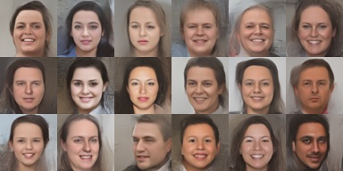
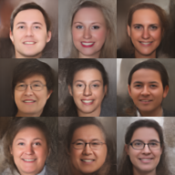
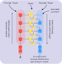

# NVAE Implementation
<p align="center">
    
</p>

This is a *close enough* implementation of *NVAE. A Deep Hierarchical Variational Autoencoder*.

Some differences with the original implementation:

- No spectral regularization
- In the discrete logistic mixture each pixel channel has its own set of selectors instead of one per pixel

Also, it's possible that this implementation contains multiple errors that make it worse than the original.


## Training
To train a new model you simply need to do:

    python3 train.py <architecure name>

with ```<architecure name>``` being the name of one of the ```.yaml``` files in ```model_configs```

For example, if you want to use ```big_logistic_mixture20latentnoflows.yaml``` the command should be:

    python3 train.py big_logistic_mixture20latentnoflows


This file contains all the architecture hyperparameters as well as training parameters such as batch size or number of epochs between checkpoints.
You can also resume training from the last checkpoint using the same command. 
The script automatically finds the last checkpoint before starting trainning.

## Sampling
To sample from a model you can use

    python3 sample.py <model params> <temperature> <optional iterations>

Here ```<model params >``` is a path to a ```.model``` or ```.checkpoint``` file. 
```<temperature>``` is a float between 0 and 1 multiplying the normal distributions involved in the sampling. 
```<optional iterations>``` is a number indicating how many iteration should be performed to move the batchnorm averages before sampling. 
Default is ```20```.

For example

    python3 sample.py my_model.checkpoint 0.4 20


## Cherrypicking
A script is also provided to cherry pick samples. It is similar to ```sample.py```.
    
    python3 cherry.py <model params> <temperature> <optional iterations>

You are going to be shown a series of 3x3 batches and you pick the best using a number ranging from  1 to 9.
If you don't like any of the ones presented you can also select 0 to go to the next batch. 
After you have picked 9 you are presented with your selection. You then select the ordering by inputting all the indexes
in the desired order.

You can also change the batch size or the amount of pictures in final output by modifying the code.

Here are some cherry-picked samples from the ```big_logistic_mixture20latentnoflows```

<p align="center">
    
</p>

## Creating your own model configuration
On top of using one of the provided configurations you may also create your own configuration.


## Details behind the NVAE architecture
In short, it is a *comb-like* structure with the encoder and decoder going in opposite directions.\
Each level of the decoder gets as input a sort of combination of the next encoder level and the previous decoder level.
As you go through the encoder tower you double the channels and half the spatial dimensions. The decoder tower behaves in the opposite way


<p align="center">
    
</p>

I talk a  bit about the NVAE structure [here](https://mgp123.github.io/2022/04/20/nvae/). 
There is a lot of diagrams, so it is much easier to follow than the code. 
There's still some stuff that is only present on the code but most of the general structure of it is there.
