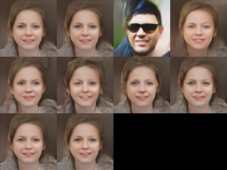

# NVAE Implementation
<p align="center">
    
</p>

This is a *close enough* implementation of *NVAE. A Deep Hierarchical Variational Autoencoder*.

Some differences with the original implementation:

- No spectral regularization
- In the discrete logistic mixture each pixel channel has its own set of selectors instead of one per pixel

Also, it's possible that this implementation contains multiple errors that make it worse than the original.


## Training
To train a new model you simply need to do:

    python3 train.py <architecure name>

with ```<architecure name>``` being the name of one of the ```.yaml``` files in ```model_configs```

For example, if you want to use ```big_logistic_mixture20latentnoflows.yaml``` the command should be:

    python3 train.py big_logistic_mixture20latentnoflows


This file contains all the architecture hyperparameters as well as training parameters such as batch size or number of epochs between checkpoints.
You can also resume training from the last checkpoint using the same command. 
The script automatically finds the last checkpoint before starting trainning.

## Sampling
To sample from a model you can use

    python3 sample.py <model params> <temperature> <optional iterations>

Here ```<model params>``` is a path to a ```.model``` or ```.checkpoint``` file. 
```<temperature>``` is a float between 0 and 1 multiplying the normal distributions involved in the sampling. 
```<optional iterations>``` is a number indicating how many iteration should be performed to move the batchnorm averages before sampling. 
Default is ```20```.

For example

    python3 sample.py my_model.checkpoint 0.4 20


## Cherrypicking
A script is also provided to cherry pick samples. It is similar to ```sample.py```.
    
    python3 cherry.py <model params> <temperature> <optional iterations>

You are going to be shown a series of 3x3 batches and you pick the best using a number ranging from  1 to 9.
If you don't like any of the ones presented you can also select 0 to go to the next batch. 
After you have picked 9 you are presented with your selection. You then select the ordering by inputting all the indexes
in the desired order.

You can also change the batch size or the amount of pictures in final output by modifying the code.

Here are some cherry-picked samples from the ```big_logistic_mixture20latentnoflows```

<p align="center">
    
</p>

## Creating your own model configuration
On top of using one of the provided configurations you may also create your own configuration. 
You can look at the ones provided as a template. Here are all the
parameters you can tweak

- ```channel_towers```. The amount of channels in the encoder/decoder towers before the pre/postprocess
- ```number_of_scales```. This determines the number of groups in the towers. You scale the spatial dimensions 
after finishing a group 
- ```initial_splits_per_scale```. This determines the number of latent variables in the first group
- ```exponential_scaling```. This indicates how you change the number of splits as you change groups.
Each time you change groups you divide the number by this constant 
- ```min_splits```. You can flatten the exponential decay by having a minimun number of latent variables that a group must have.
- ```latent_size```. The number of channels in the latent variables
- ```input_dimension```. This should reflect you image size. For 64x64 images, it should be 64 and so on.
- ```num_flows```. The amount of pair of cells in the normalizing flow. I recommend setting this to 0 
as I couldn't get good results using it. Probably due to a bad implementation.
- ```num_blocks_prepost```. The number of blocks in the pre and post process.
- ```num_cells_per_block_prepost```. The number of cell in each of those blocks
- ```cells_per_split_enc```. The number of cell in each encoder block
- ```cells_per_input_dec```. The number of cell in each encoder block
- ```channel_multiplier```. How much do you increase the channels after going through a group
- ```sampling_method```. The final network distribution. Use ```gaussian``` or ```logistic_mixture```
- ```n_mix```. Number of components on the mixture (if using ```logistic_mixture```)
- ```fixed_flows```. Whether to treat the flows as common layer and keep then at sampling time

Now, for the training parameters we have:
- ```learning_rate```
- ```regularization_constant```
- ```kl_constant```
- ```warmup_epochs```
- ```batch_size```
- ```write_reconstruction```. Boolean indicating if you also want to show how the dataset images are reconstructed during training
- ```images_per_checkpoint```. Default is none. Use only if you prefer to when you see certain number of images intead of doing it by epochs. 
- ```epochs_per_checkpoint```
- ```epochs```. For how many epochs should the model train?
- ```gradient_clipping```. Default to none. May help if you are getting nans during training. 
If you keep getting nans that the cause is a kernel is going to almost zero and so the weight normalization breaks. Gradinet clipping won't help here.

## Exploring the latent variables

A fast and loose method to check how exactly are the different latent variables affecting the result is to change one 
of the latent variables and keep the rest fixed. Here we jamm the gaussian noise that is then multiplied to get the
specific gaussian  via the re parametrization trick while keeping the noise for the other variables fixed.
It's best to use noise with high variance to make the effects more noticeable.
Here ```latent_space_exploration.py``` does this for each of the latent variables
The command is similar to ```sample.py```:

    python3 latent_space_exploration.py <model params> <temperature> <optional iterations>

Here is an example output:

<p align="center">
    
</p>


You can also manually set a couple of parameters involved by modifing the associated code.

There's a function included in the script that allows checking the effect inside the latent variable itself by 
modifying the spatial components of it. It's not a good idea to use it as the spatial dimension are usually 
relatively big (depends on the architecture but 16x16, or 8x8 are common) so they end up being pretty large.

## Details behind the NVAE architecture
In short, it is a *comb-like* structure with the encoder and decoder going in opposite directions.\
Each level of the decoder gets as input a sort of combination of the next encoder level and the previous decoder level.
As you go through the encoder tower you double the channels and halve the spatial dimensions. The decoder tower behaves in the opposite way


<p align="center">
    
</p>

I talk a  bit about the NVAE structure [here](https://mgp123.github.io/2022/04/20/nvae/). 
There is a lot of diagrams, so it is much easier to follow than the code. 
There's still some stuff that is only present on the code but most of the general structure of is there.
